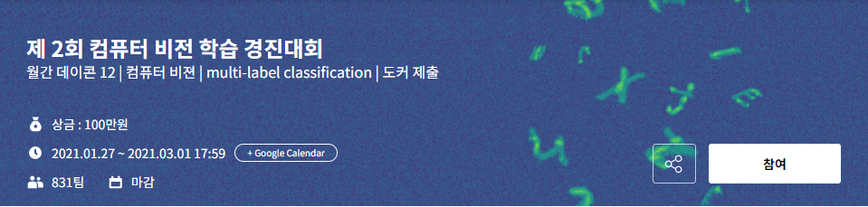
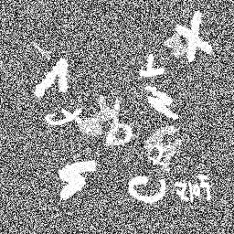
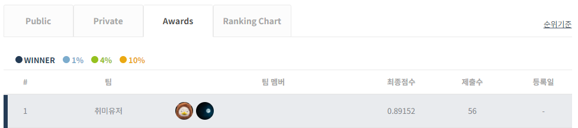

# **월간 데이콘 12 1st Solution**

## **대회 개요 [[링크]](https://dacon.io/competitions/official/235697/overview/description/)**



1. 주제  

- 합성한 MNIST 이미지 속에 들어있는 알파벳 찾기(Multi-Label Classification)

<center></center>

2. 설명  

- (256, 256) 크기의 이미지 속에 10 ~ 14개의 글자(알파벳 a – Z, 중복 제외)가 무작위로 배치되어 있습니다.  
***※ 한글은 노이즈로 처리할 것***  
- 이번 대회의 문제는 이러한 이미지 속에 들어있는 알파벳과 들어있지 않은 알파벳을 분류하는 multi-label classification입니다.

3. 주최/주관  

- 주최:Dacon  
- 주관:Dacon

4. 상금  

- 10만원

5. 결과  

- 1위


## **Prerequisites**  

- Windows10
- Cuda
- NVIDIA GPU + CUDA CuDNN

## **Training**  

- type ```train.ps1``` in powershell terminal

## **Inference**  

- type ```python inference.py``` in powershell terminal
